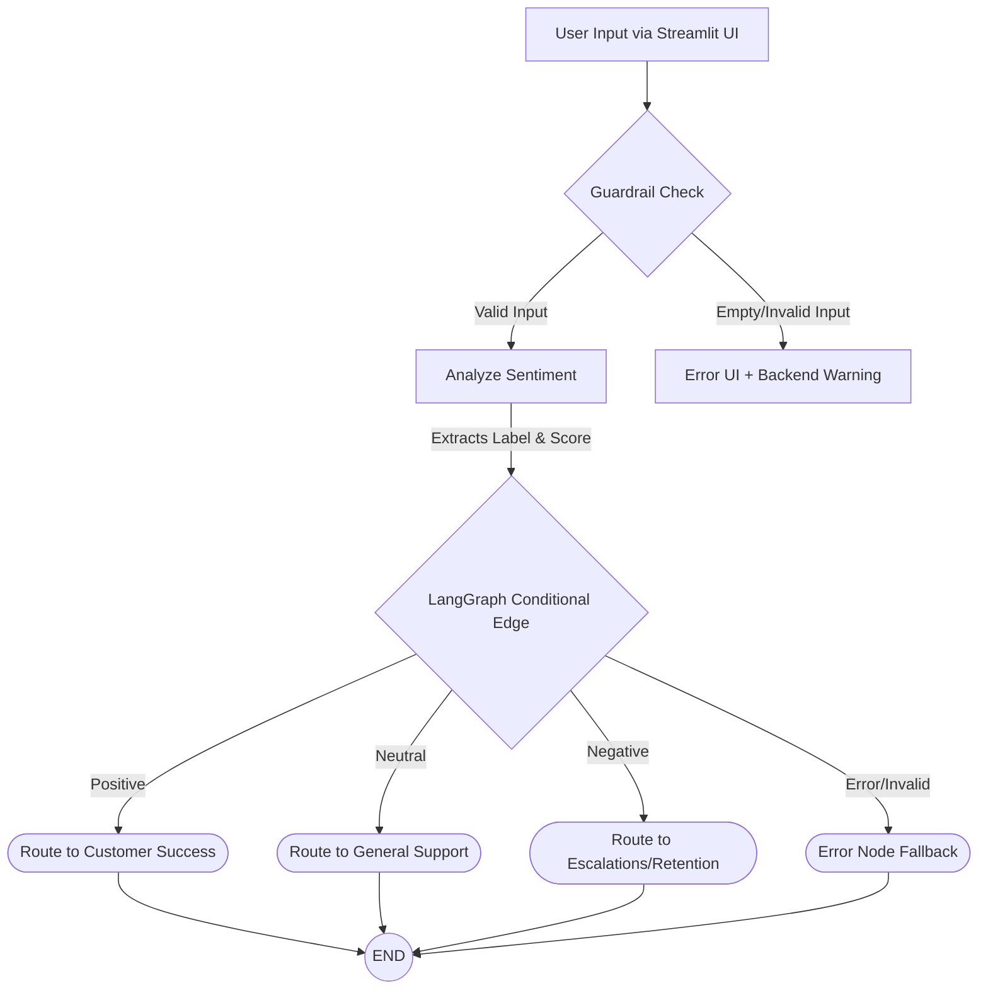

# 📊 Infographic Report: Sentiment-Based Query Routing System

## 🌟 System Overview
This project is an intelligent **Customer Support Query Router**. By blending the power of **Hugging Face Transformers** (for NLP sentiment classification) and **LangGraph** (for graph-based state management and conditional routing), the application autonomously categorizes incoming user queries and routes them to the appropriate tier of customer support.

## 🔀 Workflow Architecture

## 🎨 User Interface Design
The UI is driven by **Streamlit** and includes custom CSS for intuitive color coding:
- 🟢 **Positive Sentiment:** Rendered in Green (`#15803d`). Signifies a happy or excited customer query. Routed to *Customer Success & Referrals*.
- 🟡 **Neutral Sentiment:** Rendered in Yellow/Orange (`#ca8a04`). Signifies a factual or undecided query. Routed to *General Support*.
- 🔴 **Negative Sentiment:** Rendered in Red (`#b91c1c`). Signifies a frustrated or angry query. Highest priority. Routed to *Priority Escalations*.

## 🔑 Key Features
1. **Model Interaction:** Leverages `lxyuan/distilbert-base-multilingual-cased-sentiments-student` for deterministic, multi-class sentiment analysis output.
2. **Deterministic Routing:** LangGraph eliminates "hallucinated" routes. State transitions are statically defined.
3. **Guardrails & Fallbacks:** Graceful handling of invalid queries, empty inputs, or offline model errors.
