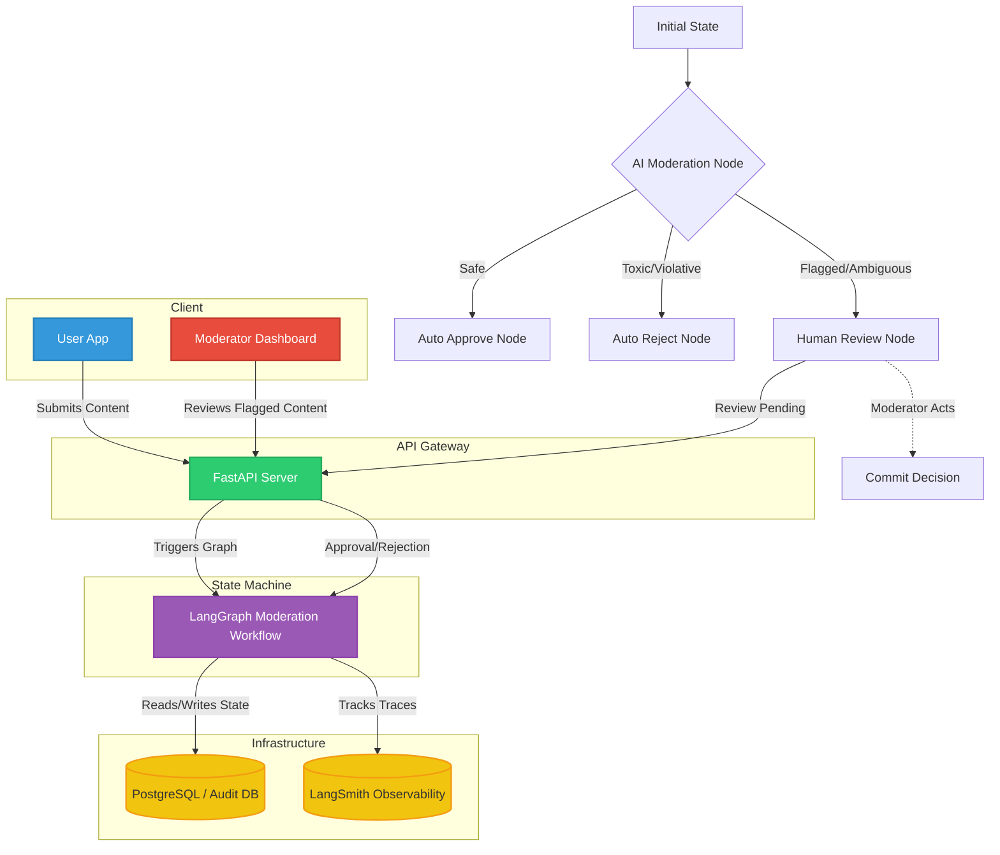

# 🚀 Human-in-the-Loop Content Moderation System

## 🌟 System Overview
The **Human-in-the-Loop (HITL) Content Moderation System** is a robust, event-driven pipeline designed to automatically analyze user-generated content and escalate ambiguous or high-risk cases to human moderators. Built with **LangGraph** for resilient state management and **FastAPI** for a snappy, intuitive reviewer API, it ensures both speed and safety in content publishing.

The system is split into three main roles:
- **System**: Handles automated ingestion, AI-based pre-screening, and final actions.
- **Moderator**: Reviews flagged content with pending states.
- **Admin**: Manages moderation policies, thresholds, and role assignments.

---

## 🏛 Architecture Diagram

---

## 🛤 Workflow Explanation

### Step-by-Step Flow

1. **📥 Ingestion Node:**
   Content arrives via the FastAPI `/moderate/submit` endpoint. A unique ID is generated, and initial metrics (timestamp, source user) are captured.

2. **🤖 AI Moderation Node (The Arbiter):**
   LangGraph invokes an LLM to evaluate the text against strict moderation rules (e.g., hate speech, PII leaks, spam, self-harm). 
   - **Threshold > 0.9:** Content is explicitly banned. Fast-tracked to rejection.
   - **Threshold < 0.2:** Content is benign. Fast-tracked to approval.
   - **Threshold 0.2 - 0.9 (Ambiguous):** Content is flagged and moved to the *Waiting for Human* state.

3. **⏸ Human Review Node (The Pause):**
   LangGraph interrupts execution using an explicit Wait State (`interrupt_before=["human_review"]`).
   The content's status is saved as `"PENDING_REVIEW"` in the database. Notifications can be triggered.

4. **🧑‍⚖️ Moderator Action:**
   A human uses the FastAPI `/moderate/{job_id}/review` endpoint (via a simple dashboard) to read the flagged content and the AI's reason for flagging. They POST their decision (Approve or Reject).

5. **🏁 Final Action Node:**
   LangGraph receives the human input, resumes the state machine, updates the final disposition in the database, and concludes the workflow.
