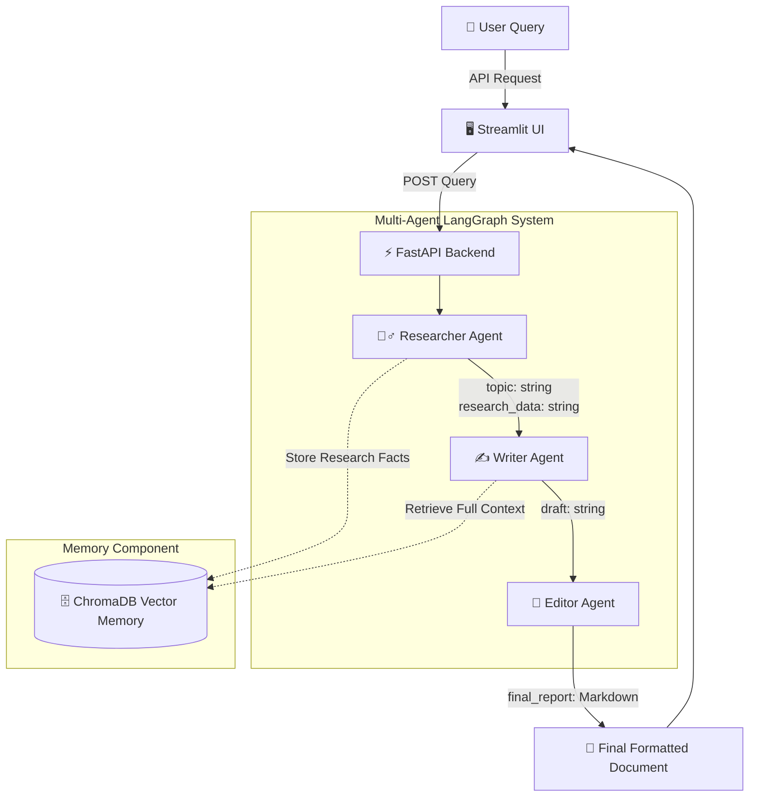

# 📊 Multi-Agent Research Pipeline infographic

## 1. System Overview
The **Multi-Agent Research Pipeline** is an orchestrated system of three AI agents that process an initial query, gather research, draft an article, and polish the final report—all independently but in sequence.

It uses:
- **LangGraph**: For orchestrating the agent state flow.
- **OpenAI (GPT-3.5-Turbo)**: For the reasoning language model behind each agent.
- **ChromaDB**: For intermediate memory storage.
- **LangSmith**: For full system tracing and observability.
- **Streamlit**: For the stunning, interactive end-user dashboard.
- **FastAPI**: For serving the LangGraph backend securely.

## 2. Agent Flow Diagram

## 3. Pipeline Explanation in Simple Visual Style
- **🕵️‍♂️ Researcher Phase**: The process begins. The agent simulates a search (or draws from LLM factual knowledge) to compile raw statistics, background data, and the most relevant key points. This raw intellect is instantly cached into ChromaDB memory.
- **✍️ Writer Phase**: The writer ignores the noisy outside world and explicitly consumes the facts passed from the `research_data` state. It transforms bullets into fluid paragraphs, building a structured "draft".
- **📝 Editor Phase**: The draft goes to the chief editor. The editor scans for grammatical inconsistencies, flow issues, and formats the output cleanly as Markdown to look professional and clear.
